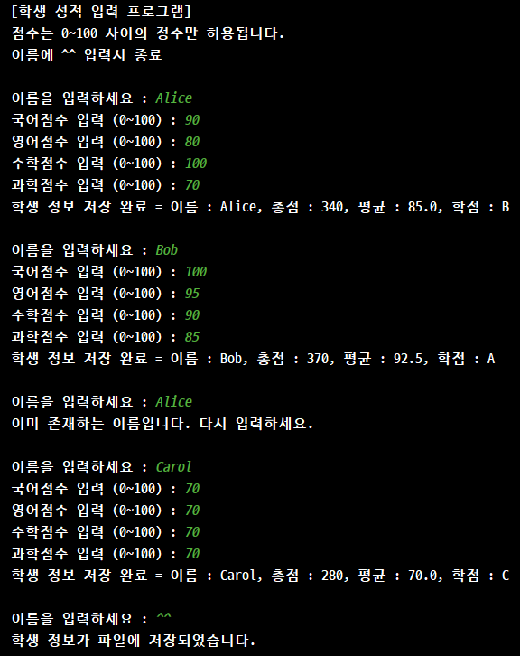
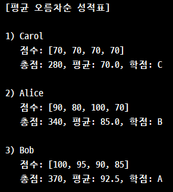
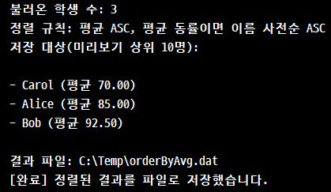

# 📘 학생 성적 관리 프로그램

JAVA의 핵심 기능인 파일 I/O, 객체 직렬화 및 역직렬화, 그리고 컬렉션 프레임워크를 활용해서
학생 데이터를 저장하고, 정렬, 출력할 수 있도록 구현했습니다.

---

## 🚩 프로젝트 구조
```
src
├─ Student.java             # 학생 데이터 모델 클래스
├─ StudentInput.java        # 학생 정보 입력 및 저장
├─ StudentOutput.java       # 정렬된 성적표를 콘솔에 출력
├─ SortedStudent.java       # 정렬된 결과를 새 파일로 저장
├─ StudentComparator.java   # 학생 객체 정렬 기준 클래스

```

---

## 📂 주요 클래스 설명

### 도메인
- **`Student`**

    - 학생의 속성 보관(`name`, `record`, `total`, `average`, `grade`)
    - `calculate()` 메서드를 통해 총점, 평균, 학점 계산
    - `toString()` 출력 포맷 제공

---

### 입출력 및 저장

- **`StudentInput`**

    - 사용자가 입력한 정보를 `HashMap<String, Student>` 을 사용해서 데이터 관리
    -  `ObjectInputStream`으로 기존 `student.dat` 파일 로드 또는 새로운 파일 생성
    - `ObjectOutputStream`을 사용해 `HashMap` 객체 전체를 `student.dat` 파일에 직렬화하여 저장
    - 이너 클래스를 사용해 데이터 로딩, 사용자 입력, 파일 저장 등 `StudentInput`의 실질적인 로직을 담당


- **`StudentOutput`**

    - `ObjectInputStream`을 사용해 `student.dat` 파일의 `HashMap` 객체를 메모리로 가져옴(역직렬화)
    -  정렬을 위해` HashMap` 의 값들만 추출하여 `ArrayList<Student>`로 변환 후 `StudentComparator` 을 적용하여 데이터를 정렬 및 출력


- **`SortedStudent`**

    - `ObjectInputStream`으로 `student.dat` 파일 로드
    - `TreeSet`에 `StudentComparator`을 적용하여 데이터를 정렬
    - 정렬이 완료된 `TreeSet` 객체를 `ObjectOutputStream`을 통해 `orderByAvg.dat` 파일에 직렬화하여 저장


- **`StudentComparator`**

    - `compare()` 메서드를 재정의하여, `Double.compare()`와 `compareTo()`로 1차(평균 오름차순), 2차(이름 가나다순) 정렬 로직 구현

---

## 🔄️ 실행 흐름
**1. StudentInput**

   - `main()` 실행 → InnerClass 객체 생성 → `loadCheck()` (기존 파일 로드) → `printUsage()` (안내문 출력) → `checkkeyAndInputData()` (사용자 입력 처리) → `saveData()` (`student.dat` 파일 저장)

**2. StudentOutput**
   
   - `main()` 실행 → `loadObjectFromFile()` (`student.dat` 로드) → `rearrangeData()` (ArrayList로 변환 및 정렬) → `printInfo()` (콘솔에 결과 출력)

**3. SortedStudent** 
   
   - `main()` 실행 → `loadObjectFromFile()` (`student.dat` 로드) → `createTreeSet()` (`TreeSet`으로 자동 정렬) → `printResult()` (상위 10명 미리보기 출력) → `outputObject()` (`orderByAvg.dat` 파일 저장)

---

## 💻 실행 예시







---

## ⚙️ 확장 포인트

- 학생 정보 수정 및 검색 추가 가능

- 데이터 저장소를 DB 기반으로 교체 가능